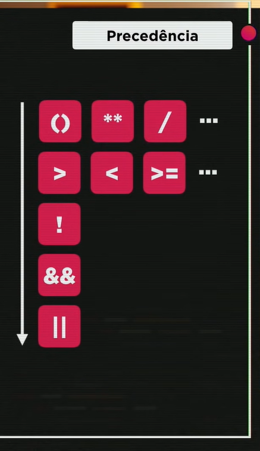

# CursoemVideo-JavaScript
 Exercícios e arquivos de aulas feito durante o curso de JavaScript do Curso em Vídeo

### Acesse o [site para executar os exercícios](https://henrique-sc.github.io/CursoemVideo-JavaScript/)

---

# Anotações

## Converter números
 - `Number.parseInt(n)` - inteiro
 - `Number.parseFloat(n)` - decimal
 - `Number(n)` - inteiro ou decimal

---

## Converter números para string
- `n.toString()`
- `String(n)`

---

## Interpolação / Template strings
- `O aluno ${nome} tirou a nota ${nota}`

*${ } = placeholder*

---

## Formatar strings
- `s.length` - retorna quantos caracteres tem a string
- `s.toUpperCase()` - TUDO PARA MAIÚSCULO
- `s.tolowerCase()` - tudo para minúsculo

*`s.toLowerCase()` e o `s.toUpperCase()` funcionam com acentos*

---

## Formatar números

### Decimal:
```
var n1 = 1545.5

n1.toFixed(2)  // 1545.50
```

### Contábil:
```
var n1 = 1545.5

n1.toFixed(2).replace('.', ',')  // 1545,00

n1.toLocaleString('pt-br', {style: 'currency', 'currency': 'BRL'})  // R$ 1.545,50
```

---

## Operadores

### Aritméticos
 ```
5 + 2   // 7   - Soma
5 - 2   // 3   - Subtração
5 * 2   // 10  - Multiplicação
5 / 2   // 2.5 - Divisão
5 % 2   // 1   - Resto da divisão inteira
5 ** 2  // 25  - Potência
 ```

 Ordem de precendência:
1. `( )`
2. `**`
3. `* /`
4. `+ -`

### Atribuição

Atribução simples
```
var a = 5 + 3          // 8
var b = a % 5          // 3
var c = 5 * b ** 2     // 45
var d = 10 - a / 2     // 6
var e = 6 * 2 / d      // 2
var f = b % e + 4 / e  // 3 
```

Auto-atribuições
```
var n = 3
n = n + 4   // 7
n = n - 5   // 2
n = n * 4   // 8
n = n / 2   // 4
n = n ** 2  // 16
n = n % 5   // 1

/* 
Simplificar: 
    n += 4 
    n -= 5
    n *= 4
    n /= 2
    n **= 2
    n %= 5
*/
```

Incremento
```
var x = 5
x++  // 6
x--  // 5
```

### Relacionais

Operador  | Nome               | Função
 -------- | ------------------ | ----------------------------------------------
 `>`      | Maior              | Verifica se um valor é maior que outro
 `<`      | Menor              | Verifica se um valor é menor que outro
 `>=`     | Maior ou igual     | Verifica se um valor é maior ou igual ao outro
 `<=`     | Menor ou igual     | Verifica se um valor é menor ou igual ao outro
 `==`     | Igual              | Verifica se um valor é igual ao outro
 `!=`     | Diferente          | Verifica se um valor não é igual ao outro
 `===`    | Idêntico           | Verifica se um valor é idêntico ao outro
 `!==`    | Desigual restrito  | Verifica se um valor não é idêntico ao outro

Exemplos:
```
5 > 2      // true
7 < 4      // false
8 >= 8     // true
9 <= 7     // false
5 == 5     // true
4 != 4     // false
5 === 5    // true
5 === '5'  // false
5 !== '5'  // false

/* idêntico: mesmo valor e mesmo tipo */
```

### Lógicos

<table>
    <tr>
        <th>Operador</th> <th>Nome</th> <th>Função</th> 
    </tr>
    <tr> 
        <td>!</td> <td>Negação (not / não)</td> <td>Retorna Falso se o resultado for verdadeiro</td> 
    </tr>
    <tr>
        <td>&&</td> <td>Conjunção (and / e)</td> <td>Retorna True se ambas as afirmações forem verdadeiras</td> 
    </tr>
    <tr>
        <td>||</td> <td>Disjunção (or / ou)</td> <td>Retorna True se uma das afirmações for verdadeira</td> 
    </tr>
</table>

```
! true   // false
! false  // true

true && true    // true
true && false   // false
false && true   // false
false && false  // false

true || true    // true
true || false   // true
false || true   // true
false || false  // false
```

Exemplo:
```
var a = 5
var b = 8

a > b && b % 2 == 0   // false && true -> false
a <= b || b / 2 == 2  // true || false -> true
```

Ordem de precedência



### Ternário

```
teste ? true : false
```

Exemplo:
```
var media = 5.5

media >= 7.0 ? 'Aprovado' : 'Reprovado'  // 'Reprovado'
media += 3                               //  8.5
media >= 7.0 ? 'Aprovado' : 'Reprovado'  // 'Aprovado'

/* ----------------------------------------------- */

var x = 8

var result = x % 2 == 0 ? 5 : 9  // result = 5

```
---

## Analisar um valor

```
var n = 10
var s = 'JavaScript'
var b = true

typeof n               // 'number'
typeof n == 'number    // true

typeof s               // 'string'
typeof s == 'boolean'  // false

typeof b               // 'boolean'
typeof b == 'boolean'  // true
```


## DOM

### Pegar elementos na tela

Comando | Resultado
 --- | ---
`document.getElementById('result')` | Pegar elemento pelo id
`document.getELementsByClassName('code')` | Pegar elementos pela classe
`document.getELementsByTagName('div')` | Pegar elementos pela tag HTML
`document.getELementsByName('email')`  | Pegar elementos pelo nome
`document.querySelector('div#result')` | Pegar elementos pela classe ou id

### Eventos

* [Lista de eventos](https://developer.mozilla.org/en-US/docs/Web/Events)

### Criar elementos dinamicamentes
```
// Criando uma tag img
var img = document.createElement('img')

// Colocando atributos
img.setAttribute('id', 'img')
img.setAttribute('src', `images/image.png`)

// Adicionando o elemento em algum lugar do site
document.querySelector('div#result').appendChild(img)

``` 

## Condições


```
if (condição) {
    // True
} else {
    // False
}
```

### Tipos de condição

1. Condição simples:
```
if (condição) {
    // True
}
```

2. Condição composta:
```
if (condição) {
    // True
} else {
    // False
}
```

3. Condições aninhadas:


```
if (condição) {
    // True

} else {
    // False

    if (condição) {
        // True
    } else {
        //True
    }
}
```

4. Condição múltipla:


## Repetições


### While
While - estrutura de repetição com teste lógico no início
```
while (condição) {
    // Bloco
}
```

Exemplo:
```
function comerPizza() {
    while (temFatia()) {
        comerFatia()
    }
}
```

## Do While
Do While - estrutura de repetição com teste lógico no final


```
do {
    // bloco
} while (condição)
```

---

[Gustavo Guanabara - Curso de JavaScript](https://gustavoguanabara.github.io/javascript/)
